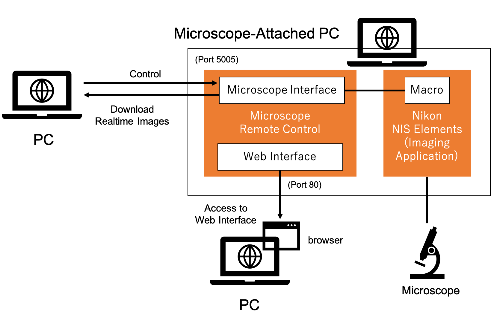

Microscope Remote Control
=========================

Microscope Remote Control is an application for remote control of a microscope system via a network. In addition to remote control of the microscope, it is also possible to download captured image data from microscope operating PC to other PC/data server during operation. Therefore, the application allows you to control the microscope from other PC, which is away from the microscope system, and display the captured images on the PC. Because the application operates as an HTTP server and can accept HTTP REST requests, it can be easily controlled with general-purpose tools such as curl.

This system composed of two components: web monitor interface and Nikon microscope interface. The Nikon microscope interface supports interaction with NIS-Elements (Imaging application for Nikon microscopes). The application converts HTTP requests to Nikon NIS-Elements macro commands to control the microscope. The web interface allows you to check the connection status, check the captured images, and check the log of remote commands from browsers.

This software was developed in collaboration with Computer Mind Co., Ltd. (https://www.compmind.co.jp/ <https://www.compmind.co.jp/>) * Please refrain from making any direct inquiries to Computer Mind Co., Ltd, the company does not take any responsibility for the usage of this software.

The source code is licensed MIT. Also the following open source libraries are used (Both are licensed MIT license).

* Json.NET 10.0.3 (https://www.newtonsoft.com/json)
* DataTables 1.10.16 (https://www.datatables.net/)

contact: ishii-crest@mats.ist.osaka-u.ac.jp

## System Overview


This system runs on Windows 10. As mentioned above, this system consists of Nikon microscope interface and web interface. The Nikon microscope interface runs on NIS Macro and external server applications, and the web interface runs on IIS and ASP.NET. We have confirmed that it works with NIS Elements 4.60.00.

The repository contains pre-compiled programs and source files. Executables are also available from the release page (identical to the contents of the bin directory). The api_sample directory contains a shell script to run the remote API, which can be remotely controlled using the curl command. The documents are Japanese only (Sorry). The API reference document is also Japanese only (Please use translation service).

## Install

Installation is a bit complicated, we prepared an instruction movie [here](installation.mp4?raw=true).

First, Install Visual C++ Redistributable for Visual Studio 2015 if it is not installed (https://www.microsoft.com/en-us/download/details.aspx?id=48145).

If you don't need the web interface, you can use only Nikon microscope interface.

### Installing Nikon Microscope Interface

- Nikon microscope interface listens for HTTP requests on port 5005 by default (configurable). Open this firewall port first (See the manual for your firewall application). Windows Defender is the Windows default firewall application.

- Run "bin\HttpConnect\HttpConnect_Setup.bat" and type "1" and Enter to install the application to the NIS Elemenets directory "C:\Program Files\NIS Elements\".

### Installing Web Interface

- Web interface runs on IIS. Enable IIS (Internet Information Service) from Control Panel -> Programs and Reatures -> Turn Windows Features on or off. In the "Windows Features" dialog box, check [Internet Information Services] and [Internet Information Services]-[World Wide Web Services]-[Application Development Features]-[ASP.NET 4.x]. Required packages are also installed.

- Copy the system files to the IIS folder. Erase all files in "C:\inetpub\wwwroot", and copy all files in the repository "bin\NISWeb" to "C:\inetpub\wwwroot". And give a full access permission for "Content" folder to "Everyone".

- Restart IIS from "Computer Management" application -> Services and Applications -> Internet Information Service (IIS) Manager -> Restart.

- Once the web interface is installed, it is always running when Windows is running.

## Quick Start

A simple example is demonstrated in the installtion movie.

Run NIS Elements as an administrator and go to menu [Macro]-[Run Macro From File] and select "HTTPConnect.mac". When "HTTP RemoteAgent" windows appears, the HTTP server accpets web remote commands.

Any web client can be used for remote command, but the easiest way is to use curl command from a shell environment. When the IP address of microscope-attached PC is 192.168.0.2, and interface port is 5005 (defaut), a remote command for curl is like:

```
$ curl http://192.168.0.2:5005/[API Commands]
```

For example, when Capture API is used, the command is like:

```
$ curl http://192.168.0.2:5005/Capture
```

If the API command has parameter(s), use ```-d``` option like:

```
$ curl -f -d 1 -d 100 http://192.168.0.2:5005/CameraSet_CHnLaserPower
```

This API has two parameters: channel no. and laser power.
The above command sets the laser power of the channel 1 to 100.
Depending on the API, some parameters are required, and others are optional.

API sample commands are included in "api_sample" folder.
Also API documents are included in this repository (Japanese only, so please use a translation service).

Again, the simple example is included in [the installation movie](installation.mp4?raw=true).
